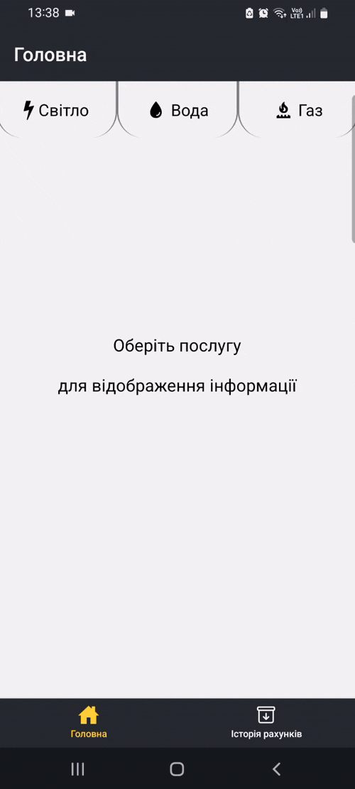
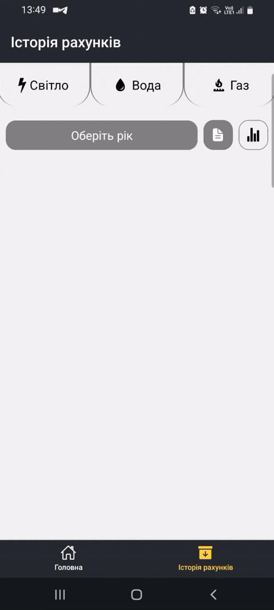
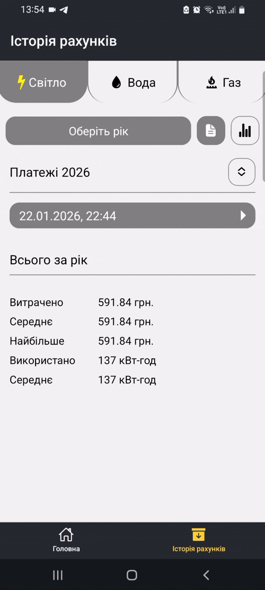

# utility-bills

This is a simple app to keep track of your utility bills. What can this application do:
- calculates utility expenses with provided indicators and tariff.
- shows the last month's bill information.
- changes or removes the last month's bill information.
- shows utility history in text and chart form.
- compares years' expenses.

To know more about this application in detail and to see the appearance of the UI, head to the [Usage examples](#usage-examples) section.

## Installation

1. Clone the repository

   ```bash
   git clone https://github.com/justAnotherNovice/utility-bills.git
   ```

2. Install dependencies

   ```bash
   cd utility-bills
   npm install
   ```
3. Run the app

   ```bash
   npm run start
   ```
The steps above are for running the project on the development server. You need the <mark>Expo Go</mark> app to be installed on your Android or IOS device to open the app.

If you want to create an actual installation file for either Android or IOS, follow the instructions here [Create your first build](https://docs.expo.dev/build/setup/).
> [!Note]
> This app  was created for Android and IOS only.

## Usage examples

### Home tab
In the GIF below, you can see how the indicators for the chosen utility are being set on the home tab of the app. After setting indicators, you can view the last month's bill information. You can also change or remove the last month's bill information. When changing, it is possible to change only the current indicator

It's important to note that before trying to set indicators, you should set the tariff rate for the utility in the settings on the home tab.



### Text view format
In the GIF below, you can see the data about utility bills for all months in the year represented in text form. There are also expenses for the whole year.



### Chart view format
In the GIF below, you can see the expenses for utility bills for all months in the year represented in chart form. By selecting two years, you can compare expenses for these years. When comparing, the overall expenses of the years can be viewed as a pie chart. 



## Future features

Except for improving the overall design of the UI and adding dynamics to it, I want to add such functionality:
- adding address information to be able to save and view the utility bills' history for different addresses.
- maybe to add the ability to actually pay for utilities through Liqpay service.

## Used technologies

- [Expo platform](https://github.com/expo/expo)
- [React native framework](https://github.com/facebook/react-native)
- [TypeScript](https://github.com/microsoft/TypeScript)
- [React native gifted charts](https://github.com/Abhinandan-Kushwaha/react-native-gifted-charts)
- [Zustand](https://github.com/pmndrs/zustand)

## Contribute
If you are interested or bored, feel free to contribute if you have found a bug or have suggestions for improvements. 
